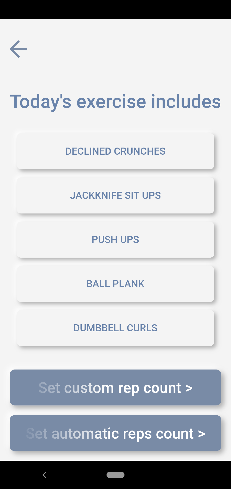
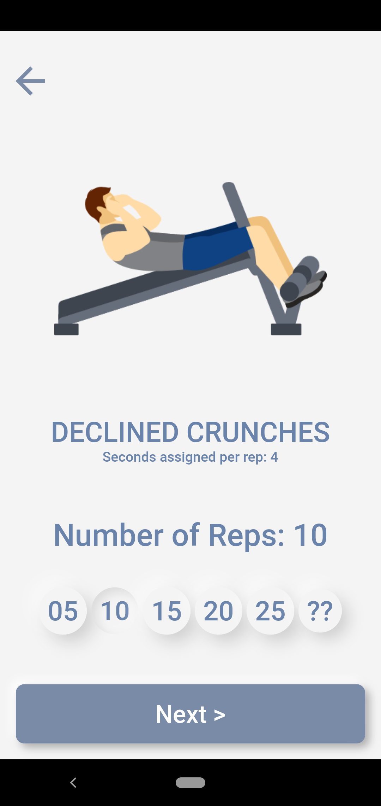
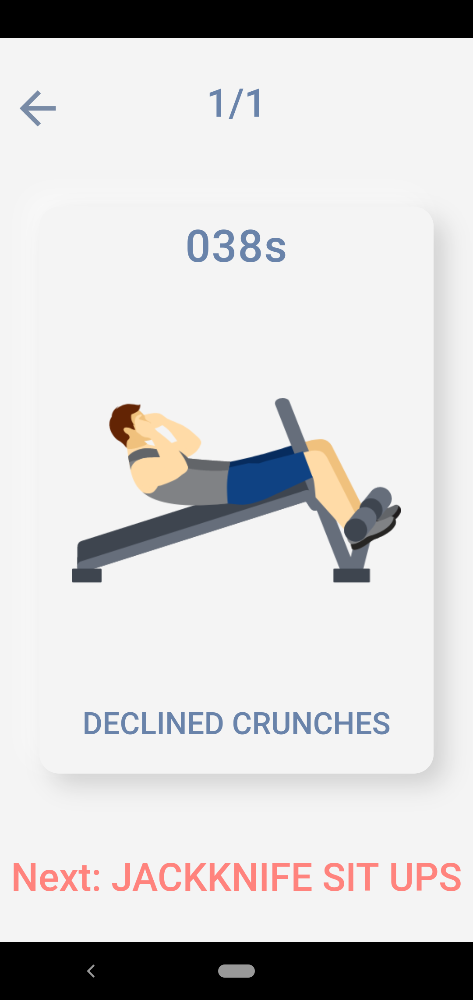

# LCO Workout  

Challenged by [Hitesh Chaudhary](https://youtu.be/VFrKjhcTAzE)

## Features 
 - Details about exercise 
 - Custom rep counts
 - Custom set counts
 - Exercises separated as daywise 
 - Music automatically starts when exercise starts
 
## Example

## Contributions
Contributions are always welcome kindly check [CONTRIBUTING.md](https://github.com/SirusCodes/LCO_Workout/blob/master/CONTRIBUTING.md)

## Download

## Developer
Darshan Rander - [LinkedIn](https://www.linkedin.com/in/darshan-rander-b28a3b193/)
